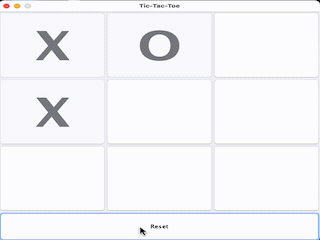

# README

# Tic-Tac-Toe
This is a java Tic Tac Toe game simulator that features two player support. A 3x3 game board is displayed for a users mouse input. This program also features a reset button that clears all characters written to the board. Currently, only two player mode is supported with plans for an additional player vs computer mode.

# Installation
Included files: clearbuttons.java, launcher.java, panel.java,TicTacToe.java, and GUI.java

Preferred method : launcher.jar
Alternative method: GUI.jar

### clearbuttons.java
This clears the program of all used characters from previous sessions 

### launcher.java
The preferred way to launch the simulation

### gui.java
Depreciated way to launch the game simulation. This program does still work and supports adding in additional games

## panel.java
Creates the game board by using JFrame.

### TicTacToe.java
This is the main program that checks if "X" or "O" is the winner, or if the game is tie. This also adds ActionListener that count and add user input to the panel. Board buttons are initialized here.

DEMO

Winner Popup

# Problems 
## DESCRIPTIONS
1. Button layout was not being displayed correctly when adding a reset button.
2. Buttons would allow double clicks from user input, reset button actionListener was not working, and clearButton count was incorrect.
## SOLUTIONS
1. I had to use BorderLayout.NORTH when specifying the placement of the reset button. I also had to correctly resize the window.
2. I had to fix my nested statements in order to properly count. Setting "String letter = "";" after my actionListener's would stop double clicks. I introduced clearbuttons to fix count issues and properly clear text from the gameboard.

# Future additions
1. allow for two-player and single-player mode